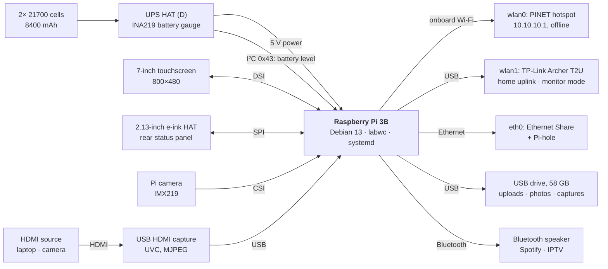

# PINET

**A Raspberry Pi 3B cyber-deck: offline hotspot and message board, e-ink status panel, touchscreen photo frame, Wi-Fi auditing toolkit and media centre in one battery-powered box.**

[](LICENSE)

-a80030)


| Demo video | Build write-up |
|---|---|
| [](https://youtu.be/Q5zrIVO-YQM) | [**PINET: Dual-Screen Pi Cyber-Deck**](https://www.hackster.io/rupal2k/pinet-dual-screen-pi-cyber-deck-7a8dd3) on Hackster.io: parts, wiring and assembly. |

PINET started as an e-ink status display and became five services sharing one
Raspberry Pi 3B. They share a tight power budget: a power manager sheds load
when the touchscreen kiosks run, and no service starts at boot unless it has to.

This repository is the source of truth for the device's code, configuration
and documentation. For the full design write-up, see
[`docs/Device Overview.md`](docs/Device%20Overview.md).

## Contents

- [Features](#features)
- [Screenshots](#screenshots)
- [Hardware](#hardware)
- [Getting started](#getting-started)
- [Usage](#usage)
- [Security and secrets](#security-and-secrets)
- [Known limitations](#known-limitations)
- [Repository layout](#repository-layout)
- [Testing](#testing)
- [Contributing](#contributing)
- [License](#license)
- [Acknowledgements](#acknowledgements)

## Features

| Subsystem | Description |
|---|---|
| **E-ink dashboard** | An always-on 2.13" rear panel showing time, CPU, memory, temperature, weather, network status, a Wi-Fi QR code and the PINET join card. Runs headless, and switches to a "PENTEST" screen in pentest mode. |
| **PINET hotspot and portal** | A self-hosted, internet-free Wi-Fi network (`wlan0`, `10.10.10.1`) with a captive-portal message board and file sharing up to 1 GB (`pinet-board`), stored on USB. Started on demand. |
| **Touchscreen** | A 7" photo frame with a fit-to-screen slideshow and double-tap wake, plus on-demand kiosks: the live Pi camera with photo and video capture, the Ezykam web app, and the PINET portal. A passcode lock screen and an on-screen keyboard are in the taskbar. |
| **Media Centre** | One launcher for three services. **Spotify** runs a Spotify Connect receiver (raspotify) that plays through a Bluetooth speaker. **IPTV** shows live Indian channels in English, Bengali and Hindi from [iptv-org](https://github.com/iptv-org/iptv), filtered to 576p streams that respond when the list opens. **HDMI** turns a USB capture dongle into a full-screen field monitor for a laptop or camera. |
| **Wi-Fi auditing toolkit** | A touch launcher for nmap, the aircrack-ng suite, wifite, reaver, bully, mdk4 and hcxtools, with an embedded terminal and a pentest power mode. For networks you own or are authorised to test. |
| **Ethernet Share** | Shares the Wi-Fi uplink out of the Ethernet port, with optional Pi-hole ad blocking. |

### Media Centre details

- **Audio routing.** Sound goes to a Bluetooth speaker. If none is connected,
  the app reconnects a paired one, trying the last-used speaker first.
  Connecting a different speaker mid-channel moves the sound to it, and the
  volume you set is kept between channels.
- **Resilience.** Streams buffer 3 seconds ahead. A dropped stream reconnects
  up to three times before giving up, and the screen stays awake while a
  channel plays.
- **Controls.** Tapping the top-left corner over a playing channel shows back,
  pause and close buttons, which hide again after four seconds.

## Screenshots

All captures come from the device's 800×480 touchscreen. Home network details,
a captured PC's taskbar and broadcast video are blurred.

| | |
|---|---|
| <br>**Desktop.** One icon per service; lock and keyboard in the taskbar. | <br>**Media Centre.** The Spotify icon turns green while it runs. |
| <br>**IPTV channel list,** filtered by language and category. | <br>**IPTV playback** with the corner controls shown. |
| <br>**HDMI monitor** showing a laptop through a USB capture dongle. | <br>**Spotify Connect,** started from a confirm dialog. |
| <br>**Confirm dialogs** before any service starts or stops. | <br>**PINET portal:** offline message board and file drop. |
| <br>**Wi-Fi auditing launcher.** | <br>**Ethernet Share** with Pi-hole. |
| <br>**Passcode lock screen.** | <br>**Brightness slider** in the taskbar (minimum 10%). |
| <br>**E-ink status panel** on the back of the device. | <br>**E-ink PINET join card** (placeholder values). |
| <br>**Code graph viewer** for browsing this repository's structure on the device. | |

## Hardware

| Component | Part | Role |
|---|---|---|
| Computer | Raspberry Pi 3 Model B (Rev 1.2) | Debian 13 "trixie", 64-bit |
| Touchscreen | Official Raspberry Pi 7" DSI display, 800×480 | Desktop, photo frame, kiosks |
| Status panel | Waveshare 2.13" e-Paper HAT (V4), SPI | Rear status display |
| Power | Waveshare UPS HAT (D), 2× 21700 cells (8400 mAh), INA219 gauge on I²C | Battery and runtime |
| Wi-Fi (onboard) | Broadcom, `wlan0` | PINET hotspot only |
| Wi-Fi (USB) | TP-Link Archer T2U Plus (RTL8821AU), `wlan1` | Home uplink; the only monitor-mode radio |
| Storage | 58 GB USB drive at `/mnt/pinet-media` | Portal uploads, photos, captures |
| Camera | Raspberry Pi camera (Sony IMX219), CSI | Camera kiosk |
| Capture | Any UVC USB HDMI capture dongle (tested: MacroSilicon MS2109) | HDMI monitor |
| Audio | Any Bluetooth speaker or headphones, via PipeWire | Spotify and IPTV sound |

### Block diagram



## Getting started

### E-ink dashboard

On a Raspberry Pi with the Waveshare 2.13" e-Paper HAT, one command enables
SPI, installs the dependencies and sets up the services:

```bash
git clone https://github.com/rupal2k/pinet.git
cd pinet/eink-dashboard && bash scripts/install.sh
```

### Everything else

The rest of PINET is installed by copying files to the paths a running
Raspberry Pi OS install expects:

| Repository path | Installed to |
|---|---|
| `scripts/bin/` | `/usr/local/bin/` |
| `scripts/sbin/` | `/usr/local/sbin/` |
| `systemd/` | `/etc/systemd/system/` |
| `etc/` | `/etc/` |
| `config/` | `~/.config/` |
| `desktop/*.desktop`, `desktop/icons/` | `~/Desktop/`, `~/.local/share/icons/` |
| `desktop/applications/` | `/usr/share/applications/` |
| `eink-dashboard/` | `~/pi-eink-dashboard/` |
| `pinet-board/` | `/opt/pinet-board/` |

This is a single-device project, so adjust users and paths to your setup.
`tests/test_consistency.py` holds the authoritative map and checks that every
installed path a script references exists in the repository.

## Usage

| Task | How |
|---|---|
| Start or stop a service | Tap its desktop icon (one tap). Every start and stop asks for confirmation first. |
| Play Spotify | **Media Centre → Spotify**, then choose **PINET** as the device in the Spotify app. The card says whether Spotify is running; tapping it while it runs stops it. |
| Watch live TV | **Media Centre → IPTV**. The list takes about 10–15 seconds to open while streams are checked. Switch the speaker on first, and disconnect it from your phone if it is paired there. |
| Use the HDMI monitor | Connect an HDMI source to the capture dongle, then tap **Media Centre → HDMI**. `HDMI_MONITOR_SIZE` and `HDMI_MONITOR_FPS` set the capture mode (default 1280×720 at 30 fps). |
| Close full-screen video | Tap the top-left corner (IPTV) or top-right corner (HDMI) to reveal the controls. |
| Lock the screen | Tap the lock icon in the taskbar. |
| Audit a network you own | Open **Kali Tools**. See [`docs/kali-tools-guide.txt`](docs/kali-tools-guide.txt). |
| Administer remotely | SSH or SFTP over `wlan1` or Ethernet. The firewall blocks both from PINET guests. |

Useful logs:

```bash
journalctl --user -t media-centre      # Media Centre and VLC
journalctl -t hdmi-monitor             # HDMI monitor
journalctl -u raspotify                # Spotify Connect
vcgencmd get_throttled                 # power: 0x0 means no under-voltage
```

## Security and secrets

- No credentials are committed. The board and guest passwords, Flask secret
  key, TLS key and lock-screen passcode exist only on the device
  (`/etc/pinet-board/`, `/etc/dsi-lock/passcode`). Set your own; the passcode
  in the source code is only a fallback default.
- The PINET hotspot is an open network by design. The portal has its own
  login, serves HTTPS itself, and the firewall blocks SSH and VNC from hotspot
  guests.
- The Wi-Fi auditing tools are for networks and devices you own or are
  explicitly authorised to test.

To report a vulnerability, see [SECURITY.md](SECURITY.md).

## Known limitations

- **Power.** The 5 V supply is the main constraint. Sustained heavy load
  (browser engines, large installs) or a loose cable can cause under-voltage,
  which can reset the whole USB bus, including the drive, the Wi-Fi dongle and
  the capture card. The kiosks use the lightweight `cog` browser, and the power
  manager sheds load. A solid 5 V / 3 A supply and a short, thick cable are the
  real fix.
- **Bluetooth audio.** The Pi 3B's onboard radio occasionally corrupts frames
  (`hci0: Frame reassembly failed` in `dmesg`), which you hear as short
  dropouts. A USB Bluetooth adapter avoids this.
- **HDMI capture.** The Pi 3B has no hardware MJPEG decoder. 720p at 30 fps
  uses about 1.2 CPU cores, and 20 fps about 0.8.
- **IPTV.** iptv-org streams are community-maintained, so channels come and
  go and some servers buffer more than others.
- **One radio for two jobs.** `wlan1` is both the internet uplink and the only
  monitor-mode radio, so pentest mode takes the Pi offline until you stop it.

## Repository layout

```
.
├── config/              # user config (~/.config): labwc, taskbar, GTK themes, autostart
├── desktop/             # desktop shortcuts, taskbar launchers, SVG icons, desktop layouts
├── docs/                # device overview, module notes, fixes log, Kali guide, screenshots
├── eink-dashboard/      # e-ink dashboard app (src/, config/, systemd/, scripts/, assets/)
├── etc/                 # /etc config: hostapd (password redacted), dnsmasq, nftables,
│                        #   NetworkManager, camera
├── pinet-board/         # PINET captive-portal web app (Flask)
├── scripts/
│   ├── bin/             # /usr/local/bin: touchscreen, camera and GUI apps (media-centre,
│   │                    #   kali-launcher, eth-share-gui)
│   └── sbin/            # /usr/local/sbin: pinet-start/stop, power management, pentest mode
├── systemd/             # service units and drop-ins
├── tests/               # unit tests (standard library only)
└── tools/               # developer tools: icon generator, code-graph refresh
```

## Testing

The test suite uses only the Python standard library and runs on any machine,
without the Pi's hardware:

```bash
python3 -B -m unittest discover -s tests
```

GUI code imports GTK lazily, so the parsing and decision logic is tested
without a display. Hardware behaviour is verified on the device.

## Contributing

Issues and pull requests are welcome. Read [CONTRIBUTING.md](CONTRIBUTING.md)
first, and follow the [Code of Conduct](CODE_OF_CONDUCT.md).

## License

Released under the [MIT License](LICENSE).

## Acknowledgements

- [iptv-org/iptv](https://github.com/iptv-org/iptv) for the public channel playlists
- [raspotify](https://github.com/dtcooper/raspotify) and [librespot](https://github.com/librespot-org/librespot) for Spotify Connect
- [VLC](https://www.videolan.org/) for stream playback
- [Waveshare](https://www.waveshare.com/) for the `waveshare_epd` e-Paper driver
