# PINET Pi

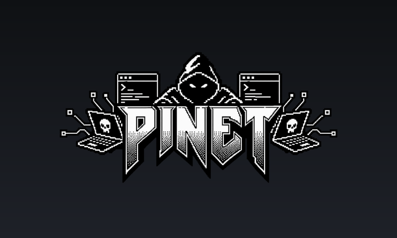

📖 **Full build write-up on Hackster.io:** [PINET: Dual-Screen Pi Cyber-Deck](https://www.hackster.io/rupal2k/pinet-dual-screen-pi-cyber-deck-7a8dd3)

A single **Raspberry Pi 3B** turned into a self-contained, multi-purpose
appliance. It began as an e-ink status dashboard and grew into five coexisting
subsystems on one board — a status panel, a private offline network + portal, a
touchscreen photo-frame / kiosk, a Wi-Fi security-testing toolbox, and a
Bluetooth media centre (Spotify + live TV) — all coordinated to share the Pi's tight power budget
without stepping on each other.

> Think of it as a pocket "home server + info appliance": it shows status at a
> glance, hosts its own guest Wi-Fi and message board with **no internet
> needed**, doubles as a photo frame and camera, can audit your own Wi-Fi, and
> streams Spotify and live TV to a Bluetooth speaker.

This repo is the source of truth for all the custom code, configuration, and
documentation that make the device what it is. See
[`docs/Device Overview.md`](docs/Device%20Overview.md) for the full write-up.

---

## Quick start

On a Raspberry Pi with the Waveshare 2.13" e-Paper HAT, one line installs the
e-ink dashboard (enables SPI, installs dependencies, sets up the services):

```bash
git clone https://github.com/rupal2k/pinet.git && cd pinet/eink-dashboard && bash scripts/install.sh
```

The rest of PINET (hotspot, portal, touchscreen apps, power services) is
installed by copying files into place; see [Deployment](#deployment).

## Features

| Subsystem | What it does |
|---|---|
| **e-Ink dashboard** | Always-on 2.13" panel: date/time, CPU/RAM/temp, weather, network, Wi-Fi QR, health, PINET join screen. Runs headless; shows a pirate "PENTEST" screen in pentest mode. |
| **PINET** | Self-hosted, **internet-free** Wi-Fi hotspot (`wlan0`, `10.10.10.1`) + captive-portal message board & ≤1GB file sharing (`pinet-board`), on USB storage. On-demand (not started at boot). |
| **DSI touchscreen** | 7" photo frame (fit-to-screen slideshow, double-tap wake) + on-demand kiosks: Ezykam web app, **live Pi camera with Photo/Video capture**, and the PINET portal. A power manager sheds load during kiosks. |
| **Kali toolbox** | Native Wi-Fi/network security tools (nmap, aircrack-ng suite, wifite, reaver, bully, mdk4, hcx…) for **authorized** auditing, plus a pentest power mode (`wifi-pentest-start/stop`). |
| **Media Centre** | One desktop icon for **Spotify**, **IPTV** and **HDMI Monitor**. Spotify Connect (raspotify) → Bluetooth speaker via PipeWire, started on demand (not at boot). IPTV plays live Indian channels in English, Bengali and Hindi at 576p from [iptv-org](https://github.com/iptv-org/iptv), filtered by language, category and search; only channels whose stream answers are listed. Sound goes to a Bluetooth speaker (a paired one is reconnected if needed, and switching speakers mid-channel moves the sound); a dropped stream reconnects by itself; corner controls (← / pause / ✕) appear on a tap; the screen stays awake while a channel plays. |
| **HDMI Monitor** | Opened from Media Centre. A USB HDMI capture dongle shown full-screen on the touchscreen, so the Pi doubles as a field monitor for a laptop or camera. The e-ink carousel keeps running with a "MONITOR MODE" strip; the screen never sleeps while it's open; the ✕ stays hidden until its corner is tapped; a frozen stream (USB reset) restarts by itself. |

## Screenshots

Captured on the device's 800×480 touchscreen. Home network details and the captured PC's taskbar are blurred.

| | |
|---|---|
| 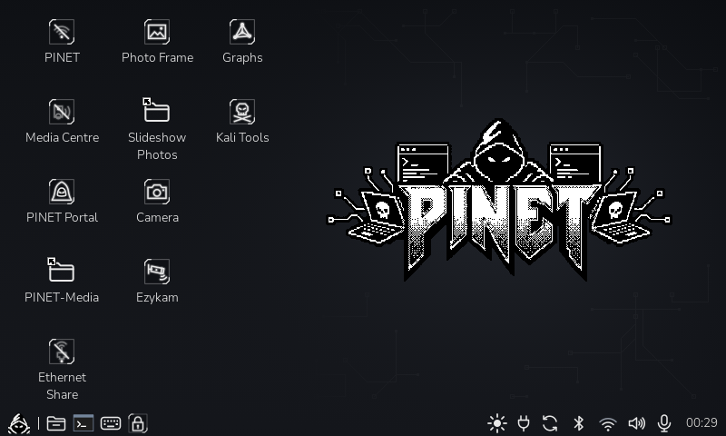<br>**Desktop**: one icon per job; Lock and keyboard in the taskbar | 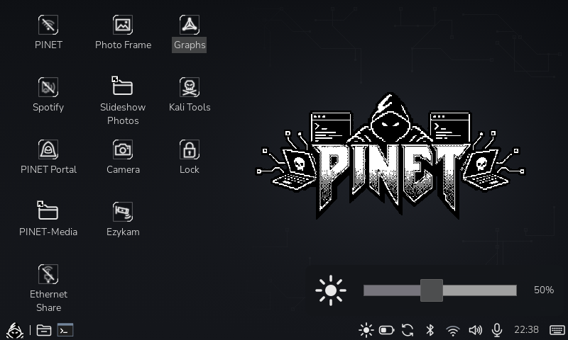<br>**Brightness slider** in the taskbar (never below 10%) |
| 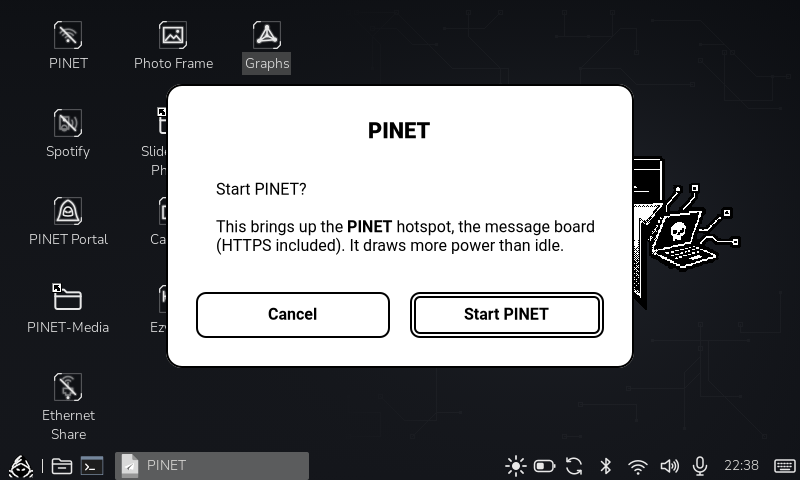<br>**Confirm dialogs** in front of every service | 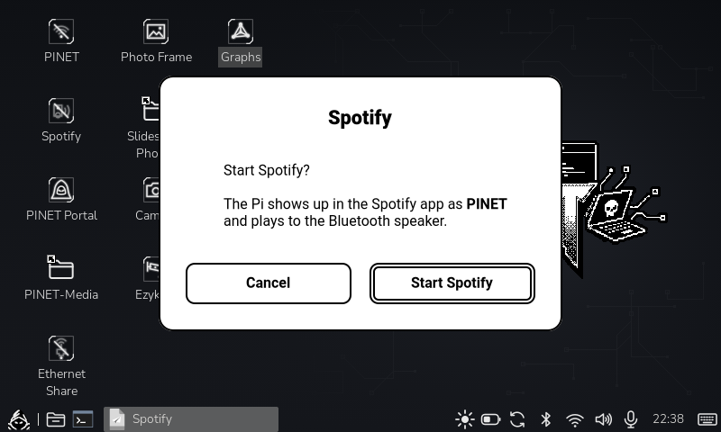<br>**Spotify Connect**, one tap to start |
| 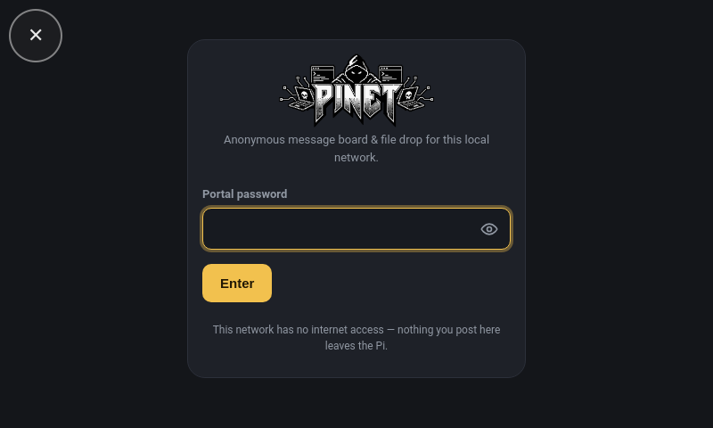<br>**PINET portal**: offline message board + file drop | 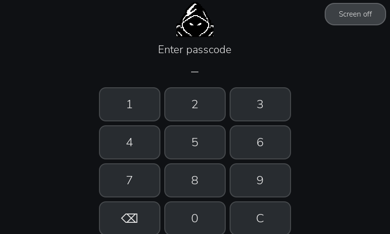<br>**Passcode lock screen** |
| 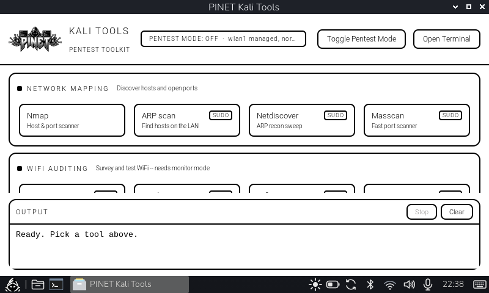<br>**Kali Tools** launcher (for networks you own) | 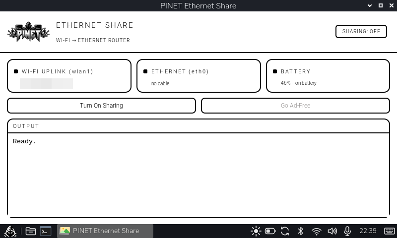<br>**Ethernet Share**: Wi-Fi → Ethernet router + Pi-hole |
| 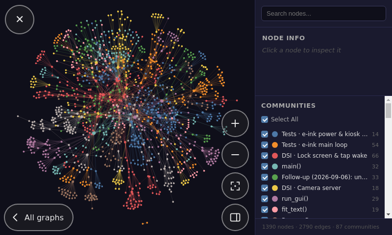<br>**Graph viewer**: browse any stored code graph | 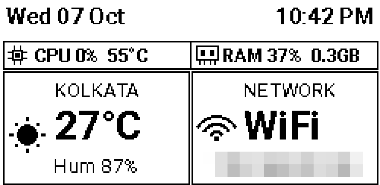<br>**E-ink status panel** (back of the device) |
| 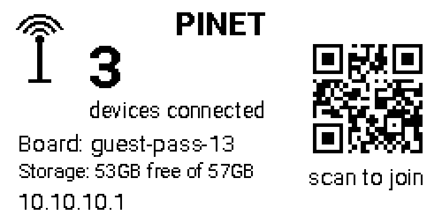<br>**E-ink PINET join card** (placeholder values) | <br>**HDMI Monitor**: a laptop over USB HDMI capture; the ✕ shows only after a corner tap |
| 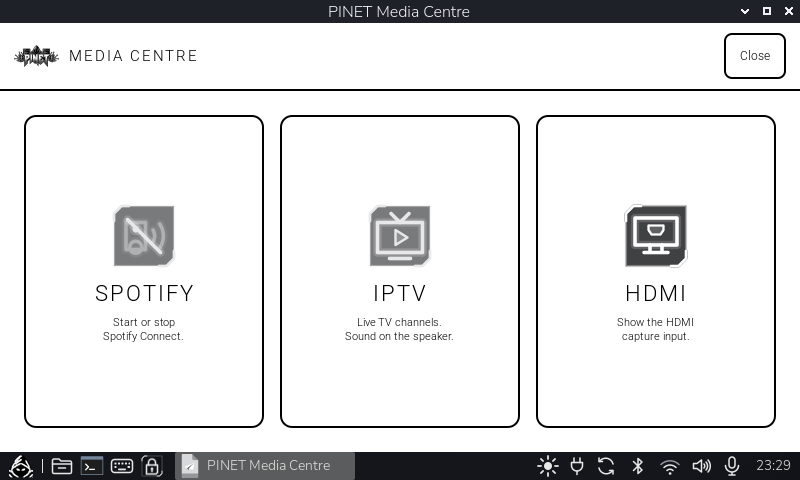<br>**Media Centre**: Spotify, IPTV or HDMI; the Spotify icon turns green while it runs | 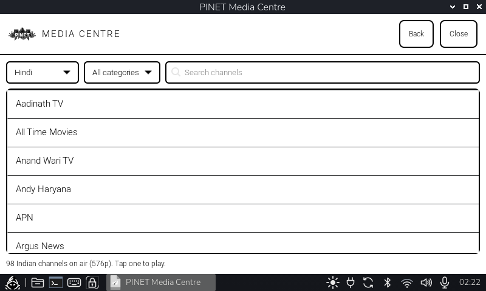<br>**IPTV**: live Indian channels by language and category |
| <br>**IPTV playing**: ← back, pause, ✕ close, shown after a tap in the top-left corner (picture blurred) | |

## Repository layout

```
.
├── docs/                      # full documentation (device overview, per-module notes,
│                              #   fixes log, Kali operating guide)
├── eink-dashboard/            # the e-ink dashboard app (src/, config/, systemd/, scripts/, assets/)
├── pinet-board/               # the PINET captive-portal web app (Flask: app.py, templates/, static/)
├── scripts/
│   ├── bin/                   # /usr/local/bin — DSI touchscreen + camera scripts (dsi-*, cam),
│   │                          #   GUI apps (media-centre, kali-launcher, eth-share-gui)
│   └── sbin/                  # /usr/local/sbin — pinet-start/stop, kali-power-shed,
│                              #   wifi-pentest-start/stop, pi-power-manager, install guard
├── systemd/                   # service units + drop-ins (raspotify override, pinet-ap-network, …)
├── etc/                       # /etc config (hostapd [pw redacted], dnsmasq, nftables, dsi-camera)
└── desktop/                   # desktop shortcuts (.desktop) + hand-drawn SVG icons
```

## Hardware

- Raspberry Pi 3 Model B Rev 1.2 · Debian 13 "trixie" (64-bit)
- Waveshare 2.13" e-Paper HAT (V4) — SPI/GPIO
- Official Raspberry Pi 7" DSI touchscreen (800×480)
- `wlan1`: TP-Link Archer T2U Plus (RTL8821AU) — uplink + the only monitor-capable radio
- `wlan0`: onboard Broadcom — dedicated to the `PINET` hotspot
- 58GB USB drive at `/mnt/pinet-media` (portal uploads, slideshow photos, camera captures)
- Bluetooth speaker via PipeWire
- Waveshare UPS HAT (D) with 2× 21700 cells (8400 mAh), INA219 battery gauge on I²C
- Raspberry Pi camera (Sony IMX219) on the CSI ribbon
- USB HDMI capture dongle (any UVC one; tested with a MacroSilicon MS2109), MJPEG up to 1080p

### Block diagram

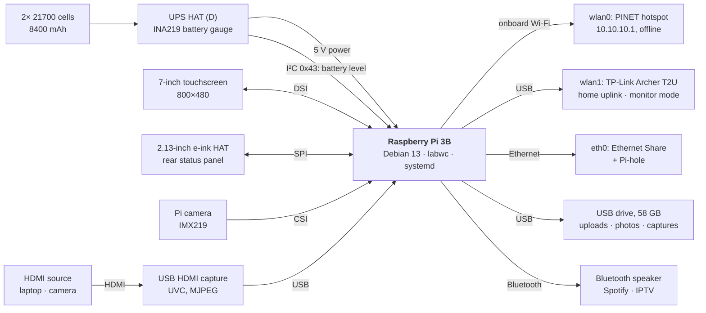

## How you operate it

- **Desktop shortcuts** (touchscreen / VNC): Camera, Ezykam, PINET Portal, Photo
  Frame, **Start PINET**, **Stop PINET**, **Kali Tools**, **Media Centre**. Icons
  open on a single tap. **Lock** is in the taskbar, next to the keyboard.
- **Media Centre → Spotify:** starts or stops Spotify Connect (asks first); play
  from the Spotify app on your phone.
- **Media Centre → IPTV:** pick a channel (opening the list takes ~10 s while
  streams are checked). Turn the Bluetooth speaker on first; if it's connected to
  a phone, disconnect it there. Tap the top-left corner for ← / pause / ✕. Logs:
  `journalctl --user -t media-centre`. Some iptv-org streams are slow or go
  offline; the app reconnects a dropped stream up to 3 times.
- **Media Centre → HDMI:** plug an HDMI source into the capture dongle and tap HDMI.
  To close, tap the top-right corner to show the ✕, then tap it. Logs:
  `journalctl -t hdmi-monitor`. `HDMI_MONITOR_SIZE` / `HDMI_MONITOR_FPS` pick the
  capture mode (default 1280x720 at 30 fps, about 1.2 CPU cores: the Pi 3B has no
  hardware MJPEG decoder; 20 fps costs about 0.8).
- **At a glance:** the e-ink panel (no interaction).
- **Remotely:** SSH/SFTP over `wlan1`/Ethernet (blocked from PINET guests by the firewall).
- **Kali:** open the *Kali Tools* shortcut; see [`docs/kali-tools-guide.txt`](docs/kali-tools-guide.txt).

## Important notes

- **Power is the main constraint.** The 5V supply is marginal — heavy sustained
  load (Chromium-class browsers, big installs, or a loose plug) can brown the
  board out. Kiosks use the lightweight `cog` browser and the power manager sheds
  load; the real cure is a solid 5V/3A supply + short thick cable. Under-voltage
  can also reset the whole USB bus (drive, Wi-Fi dongle, HDMI capture); HDMI
  Monitor notices the stalled picture and restarts the stream within ~10 s.
- **Bluetooth audio on a Pi 3B:** the built-in radio occasionally corrupts
  frames (`hci0: Frame reassembly failed` in `dmesg`), heard as short dropouts.
  A USB Bluetooth dongle avoids it.
- **PINET is offline by design** and **off by default** — start it with the
  *Start PINET* shortcut.
- **`wlan1` is dual-purpose** (uplink *and* the only pentest radio); entering
  pentest mode takes the Pi offline until you stop it.
- **Legal:** only use the Kali tools on networks and devices you own or are
  explicitly authorized to test.

## Secrets

No credentials are committed. The PINET hotspot is an open network; the portal
has its own login, serves HTTPS itself, and the hotspot firewall blocks SSH/VNC
from guests. The board/guest passwords, the Flask secret key, the TLS key and
the lock-screen passcode live only on the device (`/etc/pinet-board/`,
`/etc/dsi-lock/passcode`). Set your own; the lock screen's fallback passcode
in the code is only a default.

## Deployment

These files map onto a running Raspberry Pi OS install: `scripts/bin` →
`/usr/local/bin`, `scripts/sbin` → `/usr/local/sbin`, `systemd/` →
`/etc/systemd/system/`, `etc/` → `/etc/`, `config/` → `~/.config/`, `desktop/` → `~/Desktop` +
`~/.local/share/icons` (`desktop/applications/` → `/usr/share/applications`), `eink-dashboard/` → `~/pi-eink-dashboard`, `pinet-board/`
→ `/opt/pinet-board`. The e-ink app has its own `scripts/install.sh`. This is a
personal single-device project; adapt paths/users to your setup.
